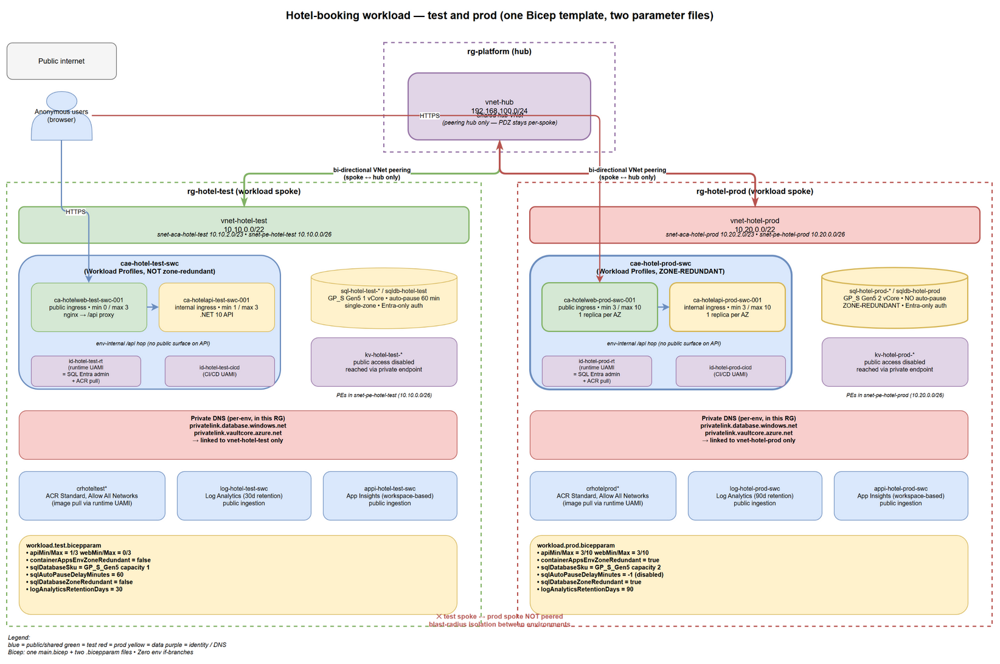

# Hotel-booking workload — multi-environment design (`test` + `prod`)

> **Status**: design + implemented. Two environments live: `test` (cost-optimised) and `prod` (zone-redundant, no scale-to-zero).
> **Region**: `swedencentral` (matches the hub; three availability zones — required for the prod zone-redundancy posture).



Source: [architecture.drawio](./architecture.drawio) (PNG has the XML embedded — open the PNG in draw.io to edit).

---

## 1. The application we are hosting

Source under [workload-app/](../workload-app/). Quick facts extracted from the code:

| Aspect | Finding | Evidence |
|---|---|---|
| Backend runtime | .NET 10 minimal API (`Microsoft.NET.Sdk.Web`) | [HotelBooking.Api.csproj](../workload-app/backend/HotelBooking.Api/HotelBooking.Api.csproj) |
| Backend dependencies | EF Core SQL Server provider, `Azure.Monitor.OpenTelemetry.AspNetCore` | same |
| Backend listener | HTTP on `8080` (set via `ASPNETCORE_URLS` env var on ACA) | [Program.cs](../workload-app/backend/HotelBooking.Api/Program.cs) |
| Backend endpoints | `GET /api/hotels`, `GET /api/hotels/{id}`, `GET /api/hotels/{id}/rooms`, `POST/GET/DELETE /api/bookings*` | [Program.cs](../workload-app/backend/HotelBooking.Api/Program.cs) |
| Data store | SQL Server (EF Core, `UseSqlServer`). Schema bootstrap via `EnsureCreatedAsync` + seed | [Program.cs](../workload-app/backend/HotelBooking.Api/Program.cs), [DbInitializer.cs](../workload-app/backend/HotelBooking.Api/Data/DbInitializer.cs) |
| DB auth | `Authentication=Active Directory Default` — passwordless, no secret to store | comment in [appsettings.json](../workload-app/backend/HotelBooking.Api/appsettings.json) |
| Required config | `ConnectionStrings__HotelDb`, `APPLICATIONINSIGHTS_CONNECTION_STRING`, `AZURE_CLIENT_ID` | [Program.cs](../workload-app/backend/HotelBooking.Api/Program.cs) |
| Frontend runtime | React 19 + Vite 7 + TypeScript + Tailwind 4, SPA | [package.json](../workload-app/frontend/package.json) |
| Frontend → backend | Same-origin `/api/*` calls (relative URL) | [src/api/client.ts](../workload-app/frontend/src/api/client.ts) |
| AuthN/Z | None in the app today — frontend is anonymous, API is open. The frontend container reverse-proxies `/api/*` to the internal-ingress API, so the only public surface is the SPA. |

---

## 2. Compute platform decision

**Choice (unchanged from the test-only design): Azure Container Apps, Workload Profiles environment, Consumption profile for both apps.** The decision still stands for prod — the only thing that changes is the values we feed the same Bicep template.

Why ACA still fits prod:

| Prod requirement | How ACA satisfies it |
|---|---|
| Zone redundancy | `zoneRedundant: true` on the env spreads replicas across the region's three AZs. Required for the workshop region (`swedencentral`). |
| No scale-to-zero, ≥3 replicas | `scaleSettings.minReplicas: 3` on each container app keeps one replica per AZ warm at all times. |
| Per-tier ingress (public SPA, private API) | Same as test — `ingressExternal: true` for web, `ingressExternal: false` for API. |
| Managed-identity SQL + ACR pull | Same UAMI pattern as test, scoped to the prod RG. |
| Passwordless data plane | Runtime UAMI is the SQL Entra admin. Deploying principal is **not** a SQL admin. |

---

## 3. One template, two parameter files

The non-negotiable principle: **one Bicep template, two parameter files**. Every difference between `test` and `prod` (scaling, SKUs, zone redundancy, address space, auto-pause) is a parameter value, **not** an `if (environmentName == 'prod') { ... }` branch in the template. A working `test` deployment is real evidence that `prod` will work too, because the same lines of Bicep render both — only the values differ.

Layout under [infra/](../infra/):

| File | Purpose |
|---|---|
| [`infra/spoke.bicep`](../infra/spoke.bicep) | Spoke VNet + bi-directional hub peering. Same for both envs. |
| [`infra/spoke.test.bicepparam`](../infra/spoke.test.bicepparam) | Test spoke values (10.10.0.0/22). |
| [`infra/spoke.prod.bicepparam`](../infra/spoke.prod.bicepparam) | Prod spoke values (10.20.0.0/22). |
| [`infra/Deploy-Spoke.ps1`](../infra/Deploy-Spoke.ps1) | `-Environment test\|prod` → chooses RG + param file. |
| [`infra/workload/main.bicep`](../infra/workload/main.bicep) | Workload (CAE, container apps, SQL, KV, ACR, Log Analytics, App Insights, identities, distributed Private DNS). Same for both envs. |
| [`infra/workload/workload.test.bicepparam`](../infra/workload/workload.test.bicepparam) | Test workload values. |
| [`infra/workload/workload.prod.bicepparam`](../infra/workload/workload.prod.bicepparam) | Prod workload values. |
| [`infra/workload/Deploy-Workload.ps1`](../infra/workload/Deploy-Workload.ps1) | `-Environment test\|prod` → chooses RG + param file, runs preflight (what-if + validate), then deploys. |
| [`infra/workload/Deploy-Images.ps1`](../infra/workload/Deploy-Images.ps1) | Out-of-band image rollout (build + push + revision update). Image revisions are owned by this script, not by the workload template — see §6.4. |

### 3.1 Parameter inventory (everything that differs between test and prod)

| Parameter | Test | Prod | Why |
|---|---|---|---|
| `environmentName` | `test` | `prod` | Drives the `<env>` token in every CAF name. |
| `spokeVnetAddressPrefix` | `10.10.0.0/22` | `10.20.0.0/22` | Non-overlapping. Each spoke peers to the hub only — never to each other. |
| `privateEndpointSubnetPrefix` | `10.10.0.0/26` | `10.20.0.0/26` | Same per-env shape. |
| `containerAppsSubnetPrefix` | `10.10.2.0/23` | `10.20.2.0/23` | `/23` is the Workload Profiles minimum. |
| `containerAppsEnvZoneRedundant` | `false` | `true` | **Set at create only — cannot be flipped on an existing env.** |
| `apiMinReplicas` / `apiMaxReplicas` | `1` / `3` | `3` / `10` | Prod keeps one replica per AZ. Test keeps a warm floor of 1 to avoid cold-start on the internal proxy hop. |
| `webMinReplicas` / `webMaxReplicas` | `0` / `3` | `3` / `10` | Public ingress can absorb a cold start in test. |
| `sqlDatabaseSku.capacity` | `1` vCore | `2` vCore | Prod has a larger floor. SKU name (`GP_S_Gen5`) stays the same family. |
| `sqlDatabaseZoneRedundant` | `false` | `true` | GP_S supports zone-redundancy in three-AZ regions. |
| `sqlAutoPauseDelayMinutes` | `60` | `-1` (disabled) | Prod data tier never idles. |
| `sqlMinCapacity` | `0.5` | `1` | Matches the floor expectation. |
| `logAnalyticsRetentionDays` | `30` | `90` | Longer retention on prod for incident review. |
| `tags.environment` | `test` | `prod` | Carries through to all resources. |

Everything else (workload name, region, hub VNet name, ACR SKU, KV SKU, identity names, etc.) is **the same** for both envs and lives in `main.bicep` as a default — no environment-specific code path anywhere.

### 3.2 Resource-group + spoke layout

Both environments live in the same subscription (workshop convention; see §7 for the multi-sub variant).

```
┌────────────────────────────────────────────────────────────────────────────┐
│  Subscription: azureholic-demo                                             │
│                                                                            │
│  rg-platform                       rg-hotel-test               rg-hotel-prod
│   └── vnet-hub                      └── vnet-hotel-test         └── vnet-hotel-prod
│        192.168.100.0/24                  10.10.0.0/22                10.20.0.0/22
│              ▲   ▲                          ▲                          ▲
│              │   │                          │                          │
│       peering│   │peering                   └─ peer to hub ─┐          │
│              │   └──────────────────────────────────────────┘          │
│              └────────────────────────────────────── peer to hub ──────┘
│                                                                            │
│   (test ↔ prod do NOT peer)                                                │
└────────────────────────────────────────────────────────────────────────────┘
```

### 3.3 Distributed Private DNS — per environment, isolated

Each workload RG owns its own `privatelink.*` zones. Zones are **not** shared between test and prod — DNS resolution is fully isolated so a name change or PE swap in one env can never bleed into the other.

| Env | Zones (live in the env's RG) | Linked to |
|---|---|---|
| Test | `privatelink.database.windows.net`, `privatelink.vaultcore.azure.net` | `vnet-hotel-test` only (registration off) |
| Prod | `privatelink.database.windows.net`, `privatelink.vaultcore.azure.net` | `vnet-hotel-prod` only (registration off) |

> **Why no hub link?** Azure rejects linking a single vnet to two Private DNS zones with the same name. The hub vnet is shared by both envs, so it cannot be linked to both `privatelink.vaultcore.azure.net` zones (one per env RG). The hub also hosts no client that needs to resolve workload private endpoints — only the spoke does. Spoke-only linking keeps each env's DNS self-contained and makes the design scale to N environments without collisions (D27).
>
> Per workshop rule: **no** `privatelink.azurecr.io`, **no** `privatelink.monitor.*`, **no** `privatelink.applicationinsights.*`, **no** AMPLS. ACR + Monitor + App Insights stay on public ingestion in both envs.

---

## 4. Per-environment resource inventory

| # | Resource | Test name | Prod name | Same in template? |
|---|---|---|---|---|
| 1 | Resource group | `rg-hotel-test` | `rg-hotel-prod` | name derived from env |
| 2 | Spoke VNet | `vnet-hotel-test` (`10.10.0.0/22`) | `vnet-hotel-prod` (`10.20.0.0/22`) | yes (param-driven address space) |
| 3 | ACA env | `cae-hotel-test-swc` (not zone-redundant) | `cae-hotel-prod-swc` (zone-redundant) | yes |
| 4 | API container app | `ca-hotelapi-test-swc-001` (min=1, max=3) | `ca-hotelapi-prod-swc-001` (min=3, max=10) | yes |
| 5 | Web container app | `ca-hotelweb-test-swc-001` (min=0, max=3) | `ca-hotelweb-prod-swc-001` (min=3, max=10) | yes |
| 6 | SQL logical server | `sql-hotel-test-<unique>` | `sql-hotel-prod-<unique>` | yes |
| 7 | SQL database | `sqldb-hotel-test` (GP_S 1 vCore, auto-pause 60 min, single-zone) | `sqldb-hotel-prod` (GP_S 2 vCore, no auto-pause, zone-redundant) | yes |
| 8 | Key Vault | `kv-hotel-test-<unique>` | `kv-hotel-prod-<unique>` | yes |
| 9 | ACR | `crhoteltest<unique>` (Standard, public) | `crhotelprod<unique>` (Standard, public) | yes |
| 10 | Log Analytics | `log-hotel-test-swc` (30d retention) | `log-hotel-prod-swc` (90d retention) | yes |
| 11 | App Insights | `appi-hotel-test-swc` | `appi-hotel-prod-swc` | yes |
| 12 | Runtime UAMI | `id-hotel-test-rt` | `id-hotel-prod-rt` | yes |
| 13 | CI/CD UAMI | `id-hotel-test-cicd` | `id-hotel-prod-cicd` | yes |
| 14 | Private DNS zones | distributed per env, linked to spoke only | distributed per env, linked to spoke only | yes |

---

## 5. Network exposure summary

Single table a reviewer should check against [workload-network-exposure.instructions.md](../.github/instructions/workload-network-exposure.instructions.md). Identical posture in both environments.

| Resource | Public reachable? | How | Reason |
|---|---|---|---|
| Frontend container app | **Yes** | ACA external ingress, public FQDN | Only user-facing surface (workshop rule). |
| Azure Container Registry | **Yes**, all networks | Standard SKU, no network rules | ACR Tasks + cross-env pull (workshop rule). |
| Log Analytics workspace | **Yes** | Default public ingestion | Workshop rule — Monitor ingestion runs over public endpoint. |
| Application Insights | **Yes** | Default public ingestion | Same as above. |
| Backend container app | **No** | ACA internal ingress (env-internal VIP) | API has no business being on the internet. |
| Azure SQL | **No** | `publicNetworkAccess: Disabled` + private endpoint | Data plane stays on the VNet; Entra-only auth removes the password surface. |
| Key Vault | **No** | `publicNetworkAccess: Disabled` + private endpoint | Same posture as SQL. |

---

## 6. Decision log

One-line rationale per decision (R = Reliability, S = Security, C = Cost, O = Ops, P = Performance). Only decisions added or changed for the multi-env design are listed; the test-only decisions (D1–D15) from the previous revision still apply.

| # | Decision | Tag | Rationale |
|---|---|---|---|
| D16 | **One Bicep template, two parameter files — zero `if (env == 'prod')` branches** | O, R | A working test deploy is real evidence prod will work too, because the same lines of Bicep render both. Forks rot. |
| D17 | Test and prod live in the same subscription, separate RGs, separate spokes | O | Workshop convention. Real-world landing zones typically split across subs — see §7 for what would change. |
| D18 | Spokes peer to the hub only — never to each other | S | Blast-radius isolation. A compromise of one env's spoke cannot reach the other env via the VNet. |
| D19 | Each env owns its own `privatelink.*` Private DNS zones | O, R | DNS isolation per env. Zone changes in one env can never bleed into the other. |
| D20 | Address space convention: test = `10.10.0.0/22`, prod = `10.20.0.0/22` | O | Non-overlapping with the hub (192.168.100.0/24) and with each other; leaves `/22` of headroom per env for future subnets. |
| D21 | ACA env `zoneRedundant` is set at create only — existing test env stays non-zone-redundant | R | The flag is immutable. Test was created without it; flipping would require destroy/recreate, which conflicts with the byte-for-byte preservation contract. Prod is created fresh **as** zone-redundant. |
| D22 | Prod SQL = serverless (GP_S) 2 vCore, **no** auto-pause, zone-redundant | R, C | Zone-redundant GP_S supports the prod availability target. No auto-pause avoids cold-start latency on first prod request. Serverless still scales compute up/down with load. |
| D23 | Prod runs ≥3 replicas per tier across AZs (`minReplicas: 3`) | R | One replica per AZ keeps the workload serving through a single-zone outage. |
| D24 | Container image is a parameter; Deploy-Workload.ps1 reads the live image from the running env and re-feeds it on every deploy | O | Image revisions are owned by Deploy-Images.ps1. Re-running the workload deploy never reverts the API or web revision back to the placeholder. Test re-deploy stays a no-op. |
| D25 | Test API keeps `minReplicas: 1` (not 0) | P | The nginx reverse proxy from the web tier to the internal API ingress is sensitive to cold-start latency; min=1 keeps one replica warm without measurably affecting test cost. |
| D26 | SQL database SKU name uses the short form (`GP_S_Gen5`, capacity in `sku.capacity`) | O | The SQL ARM API stores the short form regardless of input. Sending the long form (`GP_S_Gen5_1`) makes what-if flag a `sku.name` diff on every deploy — noise that hides real drift. |
| D27 | Per-env Private DNS zones link to the env's spoke **only** — never to the shared hub | O, R | Azure forbids linking a single vnet to two zones with the same name. With test and prod both owning their own `privatelink.vaultcore.azure.net` (and `…database.windows.net`), the shared hub can only ever link to one of them. Spoke-only linking is the only design that scales to N environments without a hub-side collision, and the hub hosts no client that needs to resolve workload PEs anyway. |

### 6.4 Why a separate image-rollout script

A workload Bicep template that hardcodes the container image runs into two failure modes:

1. **Re-deploying the env reverts revisions.** Bicep wants the desired state to match the template; if the template says `image: <placeholder>` and the live state says `image: registry/repo:abc123`, the next `az deployment group create` rolls back to the placeholder. Production outage by IaC.
2. **Image releases require a Bicep change.** Every release would need a PR against the workload template, mixing infrastructure drift with application drift in the same change set.

The workshop pattern: `main.bicep` accepts `apiContainerImage` / `webContainerImage` as parameters with a placeholder default, and `Deploy-Workload.ps1` queries the live container app before every deploy to discover the currently-running image and pass it back in via `--parameters apiContainerImage=<live>`. The result: infrastructure changes leave revisions alone, and image releases use `Deploy-Images.ps1` (which build via ACR Tasks, then update the running revision in-place). The two concerns never collide.

---

## 7. Info — multi-subscription topology (out of scope for this workshop)

This workshop runs everything in one subscription. In a real landing zone, the hub, test workload, and prod workload typically split across subscriptions for blast-radius and billing isolation. If you take this template back to that world, the things that change:

- The deploy identity (or interactive `az login` context) needs to be **set to the workload subscription** for the workload deployment, but the peering operation **also writes to the hub VNet**, which is in a different subscription. Either grant the identity `Network Contributor` cross-sub on the hub VNet resource, or split the peering into a separate deployment that runs in the hub subscription.
- The hub VNet's **subscription ID** becomes a real parameter — you can no longer rely on `subscription().subscriptionId` for the hub side of the peering. The parameter file for each workload env carries the hub subscription ID and the hub VNet resource ID explicitly.

The Bicep template would not need a single new `if (env == ...)` branch to support this — it would just need a couple of extra parameters (`hubSubscriptionId`, maybe `hubResourceId`) wired into the same modules. Forks are still avoided.

---

## 8. Review & sign-off

This design has been self-checked against:

- [copilot-instructions.md](../.github/copilot-instructions.md) — no `Chore N` references outside permitted files; ACR public; no edits to `workload-app/` source.
- [workload-network-exposure.instructions.md](../.github/instructions/workload-network-exposure.instructions.md) — no PEs on ACR/Monitor; no forbidden `privatelink.*` zones; no AMPLS.
- [azure-naming.instructions.md](../.github/instructions/azure-naming.instructions.md) — CAF abbreviations with `<env>` token throughout.
- [workload-identity.instructions.md](../.github/instructions/workload-identity.instructions.md) — passwordless SQL via runtime UAMI as Entra admin; ACR pull via UAMI; no secrets.

Verification gates for this revision:

- `Deploy-Workload.ps1 -Environment test -WhatIfOnly` against `rg-hotel-test` shows **no resource creates, deletes, or renames**. The remaining what-if "modifies" are all documented noise (provider-backfilled defaults: `Flow_Type`, `createMode`, `resolutionPolicy`, `environmentMode`, `isolationScope`, the implicit ACA traffic split, etc.) — confirmed by running the preflight and inspecting the diff line by line.
- `Deploy-Workload.ps1 -Environment prod` provisions `rg-hotel-prod` end-to-end. Hub shows two workload peerings (`...-test`, `...-prod`), both Connected, no orphans.
- `main.bicep` contains **zero** `if (environmentName == ...)` branches.
